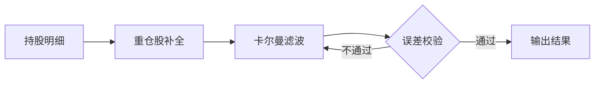

# 研究报告 Markdown 契约

## 必需框架

```markdown
# 报告标题

## 摘要

## 方法

## 回测

## 结论

# 附录
```

可以增加"行业背景、数据、风险提示、参考文献"等章节，但不得跳过核心章节。

第一个一级标题是报告标题（后处理会转成 Title 样式）。章节编号（"第X部分："、"1、"）由后处理自动添加，**Markdown 里不要手写编号**；摘要、附录、风险提示、参考文献不参与编号。内容目录与图表目录也由后处理在摘要之后自动插入，不要手写目录。

## 公式

- 行内：`$r_t=P_t/P_{t-1}-1$`
- 陈列：

```markdown
$$
R=\sum_{t=1}^{T} r_t
$$
```

不要把公式放进代码块，不要使用图片公式。

## 图表（图和表统一编号）

按国金参考稿，图和表共用一套"图表N：题"编号，全角冒号，从 1 连续递增。题注在对象上方，来源和附注在对象下方：

```markdown
图表1：行业规模与增速


来源：Wind，公司公告；统计区间：2020—2026年。
注：2026年为预测值。

图表2：回测指标

| 指标 | 数值 |
|---|---:|
| 年化收益 | 10.2% |

来源：模拟数据，仅作演示。
```

不要使用"图 1"/"表 1"分开编号或半角冒号，预检会直接报错。表格必须有表头，数字列使用右对齐。

## 流程图

流程示意图（对齐国金参考稿的"测算流程示意图"）用 ```` ```mermaid ```` 代码块书写，**与图片、表格同属图表对象**：一样要"图表N："题注在上、来源在下，一样参与统一编号和连续性校验。

````markdown
图表3：卡尔曼滤波行业仓位测算流程



来源：作者绘制。
````

构建时由 `scripts/render_diagrams.py` 调 Quarto 渲染成 PNG 再进 Pandoc，**不需要额外安装图形工具**（Quarto 已是 PPT 线的依赖）。配色取自 `design-tokens.json` 的 `word.diagram`，字体按当前档位注入，因此流程图与正文同一套品牌规则——不要在图里手写颜色。确需自定义样式时可自带 `%%{init: ...}%%` 指令，渲染器检测到后不再注入主题。

支持 mermaid 的全部图形类型（flowchart、sequenceDiagram、gantt 等）。复杂到 mermaid 表达不了的示意图，先在外部画好存为 PNG，按普通图片引用。

## 附录

附录使用一级标题并独立分页。宽表、参数清单、公式推导和补充口径优先移入附录。
