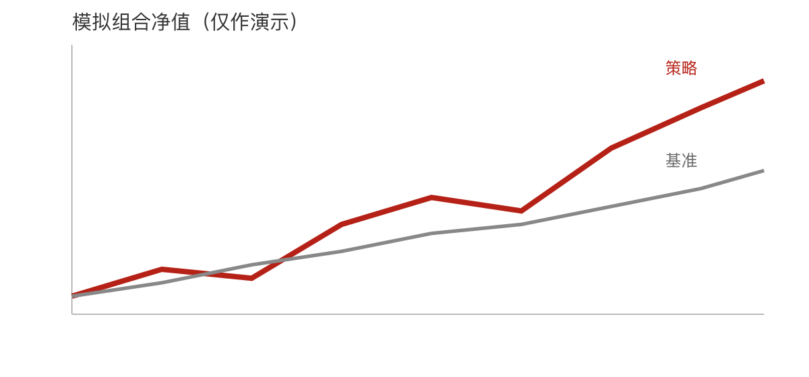

<!--
版式示范：模拟一份完整卖方研报 deck 的叙事（综述 → 回测 → 判断 → 风险 → 附录），
标题统一用「栏目：结论」节奏。每一页对应 references/slide-quality.md 决策表的一行：
KPI 卡、流程卡、图+解读、对比卡、双图、全宽表、卡片网格、结论条、附录表。
全部通过门禁（图/表放进 .columns、卡片来源写块内、结论式标题、不缩字）。
图片用相对路径 figures/sample-chart.png，不写绝对路径，不手写 reference-doc
（render_qmd_ppt.py 按 tokens 现场注入品牌母版）。数据均为模拟，仅作演示。
-->

# 一、策略综述

## 策略概览：三年 314%，回撤是主要代价

```{=ppt-kpi}
9.8%  | 年化收益
314%  | 累计收益
55.2% | 最大回撤
0.42  | 夏普比率
来源：Wind，作者测算；区间 2010—2025（模拟数据，仅作演示）
```

## 策略框架：从全 A 到目标持仓的三步筛选

```{=ppt-flow}
全 A 股票池 | 剔除上市不满三年的个股，保留进入全流通阶段的样本
三年次新股票池 | 全流通日落在上一年内；叠加现金流与财务指标过滤
目标持仓 | 季度调仓、等权买入，不加主观择时
来源：作者整理（模拟数据，仅作演示）
```

# 二、回测与验证

## 策略回测：三年累计跑赢基准约 190 个百分点

:::: {.columns}
::: {.column width="62%"}

:::
::: {.column width="38%"}
- 累计收益约 314%，基准约 120%
- 2015 年后与基准明显分化
- 全程不加任何财务或量价筛选

来源：Wind，作者测算；季度调仓、等权、不对冲不止损（模拟数据，仅作演示）。
:::
::::

## 叠加交易手段：收益增厚、波动回撤双降

```{=ppt-compare}
纯三年次新 | 总收益 92.0%；年化波动 27.1%；最大回撤 34.5%；夏普 0.34
三年次新 + 交易手段 | 总收益 139.2%；年化波动 17.4%；最大回撤 20.9%；夏普 0.81
来源：Wind，作者测算；交易手段为分批建仓、个股 15% 止损、30% 止盈（模拟数据，仅作演示）
```

## 情景分析：压力情形下回撤明显放大

:::: {.columns}
::: {.column width="50%"}


来源：作者测算（模拟数据，仅作演示）。
:::
::: {.column width="50%"}


来源：作者测算（模拟数据，仅作演示）。
:::
::::

## 风险收益：组合在收益与回撤两端均优于基准

:::: {.columns}
::: {.column width="100%"}
| 指标 | 模拟组合 | 基准 |
|------|--------:|-----:|
| 年化收益 | 9.8% | 5.3% |
| 最大回撤 | 55.2% | 48.6% |
| 夏普比率 | 0.42 | 0.28 |
| 月度胜率 | 56% | 51% |

来源：Wind，作者测算；区间 2010—2025（模拟数据，仅作演示）。
:::
::::

# 三、判断与风险

## 拐点判断：供需、盈利、估值三条腿同时落地

```{=ppt-cards}
供需侧 | 收入增速由负转正，行业订单与排产同步回升，需求侧首先确认
盈利侧 | 毛利率连续两个季度改善，费用率回落，盈利兑现进入验证期
估值侧 | 处于近五年 30% 分位以下，机构仓位偏低，估值端仍留有空间
来源：Wind，公司公告；作者整理（模拟数据，仅作演示）
```

## 拐点确认：三重信号同向才可前瞻布局

- **结论**：行业盈利在二季度确认拐点向上
- 收入端：同比增速由负转正
- 供给端：新增产能增速连续两季放缓
- 估值端：处于近五年 30% 分位以下

业务含义：可在盈利兑现前一个季度前瞻布局，而非等财报落地。

```{=ppt-takeaway}
供需、盈利、估值三重同向确认，才把拐点写成结论 —— 单一信号不足以支撑
来源：Wind，公司公告；作者整理。
```

## 风险提示：结论依赖历史统计与制度环境

- 全部结论基于历史统计，不构成投资建议
- 注册制与减持新规的调整可能改变规律适用性
- 组合年化波动接近 30%、最大回撤超过 55%
- 回测未计交易与冲击成本，实际收益将低于测算

来源：作者测算（模拟数据，仅作演示）。

# 附录

## 附录：数据口径与样本说明

:::: {.columns}
::: {.column width="100%"}
| 项目 | 说明 |
|------|------|
| 样本 | 2010 年以来上市、五年观察期完整的个股 |
| 调仓 | 季度调仓，等权配置 |
| 基准 | 国证 2000 全收益 |
| 区间 | 2010 年 1 月—2025 年 12 月 |

来源：作者整理（模拟数据，仅作演示）。
:::
::::
