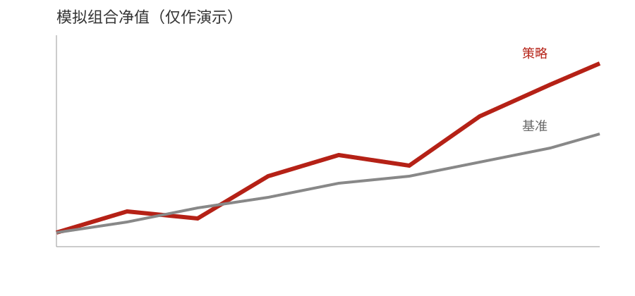

# 模拟量化策略研究

## 摘要

本文展示从结构化 Markdown 到固定版式 Word 研究报告的流程。全部数据均为模拟数据，仅作演示，不构成投资建议。

## 方法

组合单期收益率定义为 $r_t=P_t/P_{t-1}-1$，累计收益为：

$$
R_T=\prod_{t=1}^{T}(1+r_t)-1
$$

## 回测

图表1：模拟组合净值走势

来源：模拟数据，仅作演示。
注：基准净值起点设为 1.00。

图表2：模拟回测指标

| 指标 | 策略 | 基准 |
|---|---:|---:|
| 年化收益 | 10.2% | 6.4% |
| 最大回撤 | -8.1% | -11.5% |
| 夏普比率 | 1.21 | 0.74 |

来源：模拟数据，仅作演示。

## 结论

模拟结果说明该工作流能够同时承载正文、数据表、图片和公式；结果不代表真实策略表现。

# 附录

参数窗口为 20 个交易日，交易成本假设为单边 5bp。全部参数均为模拟设定。
